## Happening - A Full-Stack Event Booking Platform

Happening is a complete, full-stack event booking platform built from the ground up to handle real-world scalability challenges.

It features a modern React frontend and a high-performance Node.js backend that uses a message queue (RabbitMQ) to manage booking spikes, a Redis cache to ensure fast browsing, and a secure host-and-payout system for event organizers.


### ✨ Core Features

- **Scalable by Design**: Handles "flash sale" traffic spikes using RabbitMQ and a worker service.

- **Blazing Fast**: Implements a Redis cache for all public-facing routes, providing sub-10ms response times.

- **Advanced Search**: Full-text, category, date, and geospatial (location-based) event searching.

- **Full Host Lifecycle**: A complete admin-approval flow for users to become hosts and manage their own events.

- **Admin Analytics**: A full dashboard with revenue, capacity, and platform-wide statistics.

- **Asynchronous Booking**: A modern, non-blocking booking flow for a seamless user experience.

### 🛠 Tech Stack


| Area | Technology | Purpose |
|:-----|:------:|------:|
| Frontend | React, Vite, Axios | A modern, fast, and responsive user interface. |
| Backend | Node.js, Express | A high-performance, non-blocking API server. |
| Database | PostgreSQL | For robust, transactional data integrity. |
| Caching | Redis | To cache all high-traffic GET requests for speed. |
| Queueing | RabbitMQ | To decouple the API from the DB and manage booking spikes. |
| Payments | Razorpay | Integrated for handling (simulated) payments and refunds. |


### 🏛 System Architecture

```mermaid
graph TD
    subgraph "User / Client"
        User(👤 User Browser)
    end

    subgraph "Production Environment"
        LB(Load Balancer)
        
        subgraph "API Service (Node.js / Express)"
            API[API Server]
        end

        subgraph "Worker Service (Node.js)"
            Worker(👷‍♂️ Booking Worker)
        end

        subgraph "Datastores"
            Cache[(Redis Cache)]
            Queue[(RabbitMQ Queue)]
            DB[(PostgreSQL DB)]
        end

        User -- "HTTP Request" --> LB

        LB -- "GET /api/events/search" --> API
        API -- "1. Check Cache" --> Cache
        Cache -- "2a. Cache Hit (Fast)" --> API
        API -- "2b. Cache Miss (Slow)" --> DB
        DB -- "3. Get Data" --> API
        API -- "4. Store in Cache" --> Cache
        API -- "5. Return Data" --> LB
        
        LB -- "POST /api/bookings" --> API
        API -- "1. Send Job (Instant)" --> Queue
        API -- "2. Return 202 Accepted (Fast)" --> LB
        
        Worker -- "3. Consume Job (1-by-1)" --> Queue
        Worker -- "4. Run Transaction (Safe)" --> DB
    end
```



#### <small> <div align="center"> This diagram illustrates the separation of "read" and "write" traffic. </div> </small>

- Read (GET) requests are handled by the API and the Redis Cache.

- Write (POST) requests for bookings are decoupled using the RabbitMQ Queue and a separate Worker Service.

*(See the Backend README for the full Database ER Diagram and in-depth explanations.)*

### 💻 Run Locally


This is a full-stack project with two main parts: frontend and backend. You will need three terminal windows open to run it.

**Prerequisites**

- Node.js

- PostgreSQL

- Redis (Running on localhost:6379)

- RabbitMQ (Running on localhost:5672)

**1. Clone & Install**

```bash
git clone [https://github.com/palakgarg19/Happening.git](https://github.com/palakgarg19/Happening.git)
cd Happening
```

**2. Run the Backend (Terminal 1)**

This terminal runs the main API server.

```bash
cd backend
npm install
# Set up your .env file here (see backend/README.md for details)
npm run dev
```


✅ Server should be running on http://localhost:5000

**3. Run the Booking Worker (Terminal 2)**

This terminal runs the background worker that processes bookings.

```bash
cd backend
node worker.js
```

✅ Worker should be running and "Waiting for jobs..."

**4. Run the Frontend (Terminal 3)**

This terminal runs the React app.

```bash
cd frontend
npm install
npm run dev
```


✅ App should be running on http://localhost:5173

You can now open http://localhost:5173 in your browser to use the full application.

### 📂 Project Structure


```
happening/
├── backend/
│   ├── assets/
│   ├── config/
│   ├── middleware/
│   ├── routes/
│   ├── .env.example
│   ├── openapi.yaml
│   ├── README.md
│   ├── server.js
│   └── worker.js
├── frontend/
│   ├── src/
│   ├── README.md
│   └── ...
└── README.md
```
